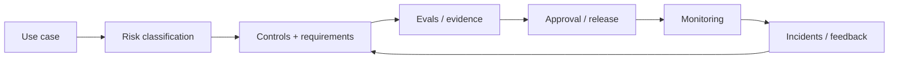

# AI Governance, Responsible AI and Model Risk：AI 治理、责任与模型风险

[English version](../en/24-ai-governance-model-risk.md)

Security 主要问：

> attacker / malicious input 能不能让系统越权、泄露或执行危险动作？

Governance 问得更广：

> **Who owns the risk? What evidence is required before release? What behavior is prohibited? How are changes reviewed, monitored, audited, and rolled back?**

## Governance Lifecycle



## 1. 从 Use-Case Risk 开始，而不是看 Model 名气

同一个 model 在不同 workflow 里风险完全不同。

例如：

- draft internal notes：通常较低风险；
- recommend a refund：中等 operational risk；
- autonomously issue payment：高 action risk；
- employment/credit/health consequential decision：可能具有高 legal / human-impact risk。

所以应该 classify **system + use case**，不是只 classify model。

## 2. Define Ownership

每个 production AI capability 应明确：

- product outcome owner；
- technical operation owner；
- data owner；
- security/privacy owner；
- evaluation/quality owner；
- incident-response owner。

非常典型的 governance failure：

> **Everyone assumed someone else owned the risk.**

## 3. Model / System Inventory

维护 inventory：

- models/providers；
- model versions/aliases；
- prompts/policies；
- retrieval indexes/data sources；
- tools/actions；
- fine-tuned adapters；
- external dependencies；
- approved use cases。

当 provider/model/policy/data source 改变时，这个 inventory 非常重要。

## 4. Risk Taxonomy

可包括：

- factual / quality risk；
- safety risk；
- privacy / confidentiality risk；
- security risk；
- bias / fairness risk；
- legal / compliance risk；
- financial / operational risk；
- reputational risk；
- autonomy / action risk。

不要把所有问题都概括为 “hallucination”。

## 5. Controls 要与 Risk 匹配

可以使用：

- grounding / citations；
- deterministic validation；
- policy filters；
- access control；
- approval gates；
- action limits；
- rate/cost limits；
- sandboxing；
- logging / audit；
- fallback；
- human escalation；
- restricted deployment population。

风险越高，release evidence 与 controls 应越强。

## 6. Release Evidence

Production release 不应该只靠：

> “demo looked good.”

应该有 evidence package：

```text
use case + risk class
architecture / data-flow diagram
model and prompt versions
eval dataset + results
segment/safety results
known limitations
security review
privacy/data-retention decision
rollback plan
owner / approver
```

## 7. Known Limitations

主动记录：

- unsupported languages；
- weak document types；
- high-risk tasks that must be refused；
- known retrieval gaps；
- tool/action boundaries；
- confidence limits。

成熟系统不是假装 uncertainty 不存在，而是知道 limitation 在哪里。

## 8. Human Oversight

Human-in-the-loop 不是在 UI 上写一句 “AI may make mistakes”。

必须定义：

- 什么情况 trigger review；
- reviewer 能看到什么 context；
- user 能否 edit/override；
- 谁 authorized to approve；
- approval 如何 audit；
- reviewer 没响应时怎么办。

## 9. Auditability / Traceability

重要 workflow 应保留足够 evidence reconstruct：

- request/input；
- model/prompt version；
- retrieved evidence；
- tool calls/results；
- policy decisions；
- human approval；
- final action/output。

同时平衡 privacy / retention requirements。

## 10. Change Management

以下任何一项变化都可能改变 AI behavior：

- model version；
- provider behavior；
- prompt；
- retrieval corpus/index；
- tool schema；
- policy；
- fine-tune；
- upstream data。

定义哪些 change 必须触发：

- regression eval；
- security review；
- approval；
- canary rollout；
- user communication。

## 11. Model / Provider Update

不要默认 newer model 可以直接替换 older model。

正确流程：

`candidate model → offline eval → safety/segment eval → shadow/canary → monitor → promote/rollback`

Model upgrade 本质上也是 release。

## 12. Incident Response

准备 AI-specific incidents：

- data exposure；
- unsafe tool action；
- widespread hallucination/regression；
- prompt-injection campaign；
- provider/model outage；
- policy bypass。

Incident loop：

```text
detect
→ contain / disable risky capability
→ preserve evidence
→ assess impact
→ communicate/escalate
→ remediate
→ add regression/security tests
→ postmortem
```

## 13. Fairness / Segment Performance

如果 use case 会显著影响人，aggregate accuracy 可能掩盖 segment disparity。

必要时：

- define relevant cohorts；
- measure segment-level errors；
- inspect data coverage / label quality；
- involve domain/legal stakeholders；
- 不要为了“测 fairness”而擅自推断本不该收集的 demographic attributes。

核心问题：

> **For whom, and under what conditions, does the system work?**

## 14. Privacy by Design

上线前明确：

- 什么 user data 发给哪个 provider；
- retention/logging rules；
- PII/secrets redaction；
- provider training-use settings；
- deletion workflow；
- trace access；
- regional/data-residency constraints（适用时）。

不要等 production logs 已经存满 sensitive prompts 才设计 privacy architecture。

## 15. Governance 不能代替 Engineering

Policy 如果没有 technical enforcement，控制力很弱。

例如：

- “不要访问无权限数据” → ACL enforcement；
- “不能消费超过 $100” → deterministic action limit；
- “高风险 action 需要人工批准” → executable approval gate。

尽量把 policy 翻译成：

- code；
- configuration；
- tests；
- observable evidence。

## Hands-on Exercise

为 Operations Agent 做一个 **Release Evidence Package**：

1. use-case/risk classification；
2. ownership matrix；
3. architecture/data-flow；
4. model/data/tool inventory；
5. eval + safety results；
6. known limitations；
7. approval matrix；
8. audit/retention policy；
9. rollback plan；
10. incident playbook。

## Definition of Done

你能够：

- classify use-case risk；
- define accountable ownership；
- maintain model/system inventory；
- map risk → technical controls；
- prepare release evidence；
- design human oversight / auditability；
- manage model/data/prompt changes；
- create AI-specific incident response loop。

---

[← Multimodal AI Systems](23-multimodal-ai-systems.md)
